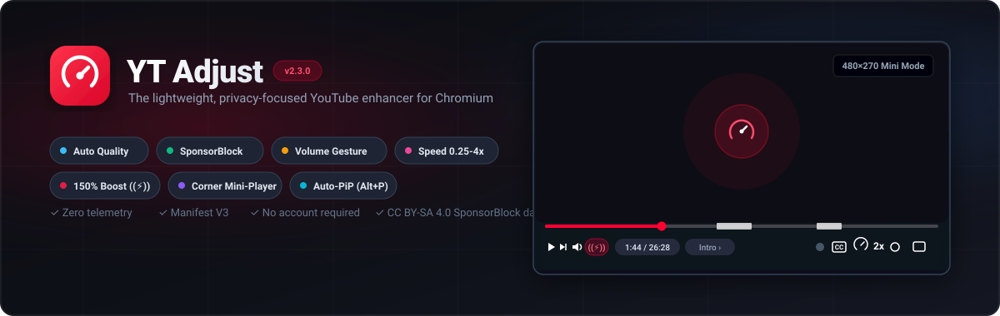

<p align="center">
  
</p>

<p align="center">
  <a href="https://github.com/Yeamin-Sheikh/yt-adjust/releases/tag/v2.3.4"></a>
  <a href="https://developer.chrome.com/docs/extensions/mv3/intro/"></a>
  
  
  
</p>

<p align="center">
  <strong>The lightweight, privacy-focused YouTube enhancer for Chromium browsers.</strong><br>
  Replaces heavy multi-extension setups with a single, fast, zero-telemetry tool.
</p>

<p align="center">
  <a href="https://github.com/Yeamin-Sheikh/yt-adjust/releases/download/v2.3.4/yt-adjust-v2.3.4.zip">
    
  </a>
</p>

<p align="center">
  <a href="#features">Features</a> •
  <a href="#quick-shortcuts">Shortcuts</a> •
  <a href="#installation">Installation</a> •
  <a href="#settings-reference">Settings</a> •
  <a href="#architecture">Architecture</a>
</p>

---

## Features

| Feature | Description | Interface details |
|---|---|---|
| **Auto quality** | Forces your preferred resolution (1080p, 1440p, 4K) on every video start. Falls back to the highest available quality if preferred is unavailable. | Settings menu automation |
| **SponsorBlock** | Auto-skips sponsored segments, self-promotions, intros, and interaction reminders using the privacy-friendly hash-prefix [SponsorBlock API](https://sponsor.ajay.app/). | White seekbar segment markers with undo toast |
| **Volume gesture** | Hold right-click on the video player and scroll up or down to adjust volume. Right-clicking without scrolling opens the context menu normally. | Centered numeric volume HUD overlay |
| **Speed control** | Hold <kbd>Shift</kbd> and scroll over the video, or hover over the speed button in the player controls and scroll to adjust rate (0.25x to 4x). | Injected 14px YouTube-styled dynamic pill |
| **Volume boost** | 150% volume amplification powered by Web Audio API GainNode. Blends seamlessly into YouTube player bar next to the volume slider. | `((?))` pill button in player controls |
| **Scroll mini-player** | When scrolling down to read comments, the video floats in a responsive 480x270 box in the top-right corner without layout shifts or black frames. | Dynamic corner mini-player |
| **Picture-in-Picture** | Native HTML5 Picture-in-Picture toggle via shortcut, plus auto-PiP mode that activates when switching away from the playing video tab. | <kbd>Alt</kbd> + <kbd>P</kbd> or automatic tab switch |

---

## Quick shortcuts

| Shortcut | Action |
|---|---|
| <kbd>Alt</kbd> + <kbd>P</kbd> | Toggle native Picture-in-Picture on active video |
| Right-click + Scroll | Smooth volume adjustment (default 5% per tick) |
| <kbd>Shift</kbd> + Scroll | Smooth playback speed adjustment (0.25x to 4.0x) |
| Hover speed button + Scroll | Scroll directly over player speed button to adjust speed |
| Click speed button | Instantly reset playback rate back to 1.0x |
| Click `((?))` boost button | Toggle 150% audio amplification |
| <kbd>Enter</kbd> during skip toast | Instantly undo SponsorBlock skip and jump back |

---

## Installation

### Option 1: Load pre-built release ZIP (recommended)

1. Download **[yt-adjust-v2.3.4.zip](https://github.com/Yeamin-Sheikh/yt-adjust/releases/download/v2.3.4/yt-adjust-v2.3.4.zip)** from the releases page.
2. Extract the archive into a folder on your computer.
3. Open your Chromium browser (Chrome, Helium, Brave, Edge, Opera) and navigate to `chrome://extensions` (or `helium://extensions`).
4. Toggle **Developer mode** in the top-right corner.
5. Click **Load unpacked** and select the extracted folder.

### Option 2: Clone repository from source

```bash
git clone https://github.com/Yeamin-Sheikh/yt-adjust.git
cd yt-adjust
npm install
npm test
```
Load the `yt-adjust` directory into `chrome://extensions` using **Load unpacked**.

---

## Settings reference

Click the extension icon in your browser toolbar to open the settings popup. All settings persist via `chrome.storage.sync` and take effect immediately across all open YouTube tabs without page reload.

| Setting | Default | Description |
|---|---|---|
| Auto quality | Enabled | Force video resolution automatically |
| Preferred quality | 1080p | 4K (highres) / 1440p (hd1440) / 1080p (hd1080) / 720p (hd720) / 480p / Auto |
| SponsorBlock | Enabled | Skip community-reported video segments |
| Skip categories | Sponsor, Self-promo, Interaction | Filter which segment types are skipped |
| Skip notifications | Enabled | Show toast notification with undo button when skipping |
| Volume gesture | Enabled | Right-click + scroll wheel volume adjustment |
| Volume step | 5% | Volume change step percentage per scroll tick (1% to 10%) |
| Speed control | Enabled | Shift + scroll and player button hover-scroll speed adjustment |
| Speed step | 0.25x | Playback rate delta per scroll tick (0.1x, 0.25x, 0.5x) |
| Volume boost | Enabled | Show `((?))` button in player bar for 150% audio amplification |
| Mini player | Enabled | Float video in top-right corner when scrolling down to comments |
| Picture-in-Picture | Enabled | Enable native HTML5 Picture-in-Picture toggle (<kbd>Alt</kbd> + <kbd>P</kbd>) |
| Auto-PiP on tab switch | Disabled | Automatically enter PiP when switching away from playing video tab |

---

## Architecture

Built strictly on Chrome Manifest V3 using a dual content script architecture communicating over secure, origin-verified `window.postMessage`:

```
+-------------------------------------------------------------+
¦                       Browser Popup                         ¦
¦   Settings UI (popup.html / popup.css / popup.js)           ¦
¦   Persists user preferences via chrome.storage.sync         ¦
+-------------------------------------------------------------+
                               ¦ chrome.storage.sync
+------------------------------?------------------------------+
¦             content/isolated.js (ISOLATED World)            ¦
¦  - Reads and watches chrome.storage settings changes         ¦
¦  - Fetches SponsorBlock API via privacy hash prefixes       ¦
¦  - Caches video segments with LRU/FIFO memory bounding      ¦
¦  - Validates extension context lifecycle across reloads     ¦
+-------------------------------------------------------------+
                               ¦ window.postMessage (origin-checked)
+------------------------------?------------------------------+
¦                content/main.js (MAIN World)                 ¦
¦  1. Quality automation (YouTube player settings menu)       ¦
¦  2. SponsorBlock skipping (requestVideoFrameCallback sync)  ¦
¦  3. Right-click + scroll volume gesture with HUD overlay    ¦
¦  4. Shift + scroll speed control with 14px dynamic badge    ¦
¦  5. Volume boost (150% Web Audio API GainNode pipeline)     ¦
¦  6. Scroll mini-player (in-place anchor DOM stabilization)   ¦
¦  7. Picture-in-Picture (Alt+P and MediaSession integration) ¦
+-------------------------------------------------------------+
```

---

## Development and testing

```bash
# Type check without compiling JS to TS
npm run typecheck

# Syntax validation across all scripts
npm run lint:syntax

# Run full empirical and adversarial test suite (61 tests)
npm test
```

---

## File structure

```
yt-adjust/
+-- assets/
¦   +-- banner.svg                 # Vector hero banner for repository
+-- content/
¦   +-- isolated.js                # Isolated world: Chrome storage, SponsorBlock API
¦   +-- main.js                    # Main world: HTML5 video player integration (7 modules)
+-- icons/
¦   +-- icon16.png
¦   +-- icon48.png
¦   +-- icon128.png
+-- popup/
¦   +-- popup.html                 # Extension settings panel
¦   +-- popup.css                  # Dark mode styling with 125% DPI support
¦   +-- popup.js                   # Settings sync controller
+-- tests/
¦   +-- adversarial-stress-suite.mjs # Network and storage resilience tests
¦   +-- empirical-challenger.js      # Player lifecycle, audio, CSP, and PiP tests
+-- types/
¦   +-- extension.d.ts             # TypeScript declarations for Chrome & YouTube APIs
+-- manifest.json                  # Manifest V3 configuration (v2.3.4)
+-- package.json
+-- tsconfig.json
+-- .gitignore
+-- README.md
```

---

## Credits

Developed and maintained by **Sheikh Technology LLC**.

SponsorBlock segment data provided by [sponsor.ajay.app](https://sponsor.ajay.app/), licensed under [CC BY-SA 4.0](https://creativecommons.org/licenses/by-sa/4.0/).
